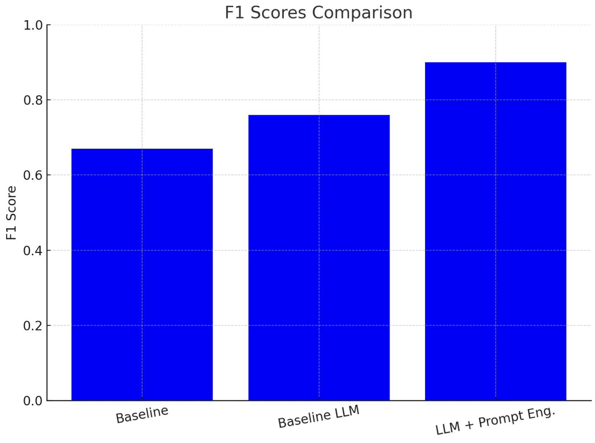

# Event Attendance Classification

The system uses two approaches:
1. A simple keyword-based baseline model
2. An LLM model that considers post content, context, and temporal information

## Installation

1. Clone the repository

2. Add the .xlsx file in the root file

2. Set up your OpenAI API key:

```export OPENAI_API_KEY="your-api-key"```

3. Run the script:

```python models/models.py```

The script will output metrics for both the baseline and GPT-based models, and save predictions to CSV files.

### Results/Evals:

```
Metrics for BASELINE_PREDICTED_ATTENDANCE:
Confusion Matrix:
Predicted    0   1
Actual            
0          164   0
1           43  43
Precision: 1.00
Recall: 0.50
F1 Score: 0.67

Metrics for PROMPT_PREDICTED_ATTENDANCE_BASE:
Confusion Matrix:
Predicted    0   1
Actual            
0          137  27
1           17  69
Precision: 0.72
Recall: 0.80
F1 Score: 0.76

Metrics for PROMPT_PREDICTED_ATTENDANCE:
Confusion Matrix:
Predicted    0   1
Actual            
0          146  18
1            1  85
Precision: 0.83
Recall: 0.99
F1 Score: 0.90
```
(note - reruning might lead to slightly different results due to inherent non-determinism in the LLMs)

Conclusion: LLM performs better than baseline and a lot better when given the right context around dates/location of event vs. date/time of post.



Some other things that did not improve performance (but might with more work):

- adding examples
- adding CoT prompting

Future work:

- Add structured outputs
- Binary Classification Model based on Embeddings/Bag of Words + Timestamp
- Add Confidence Intervals to the evals
- Use Log Probabilities from Model output